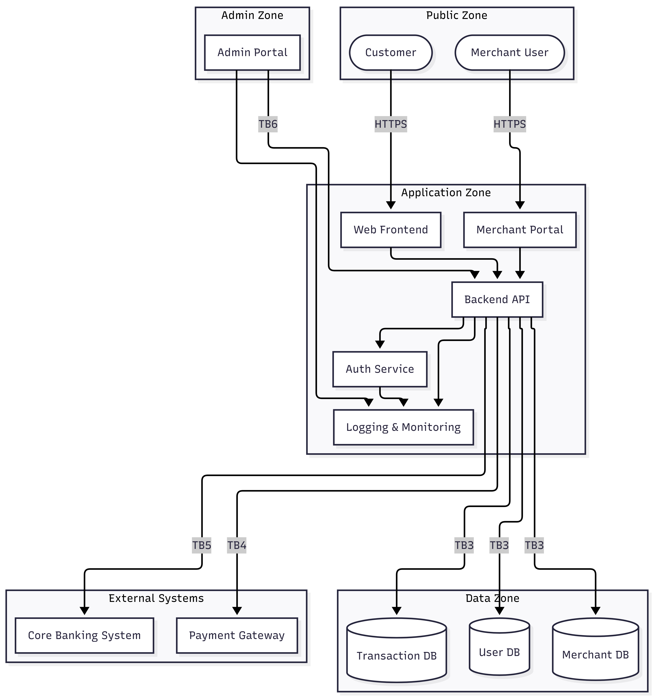
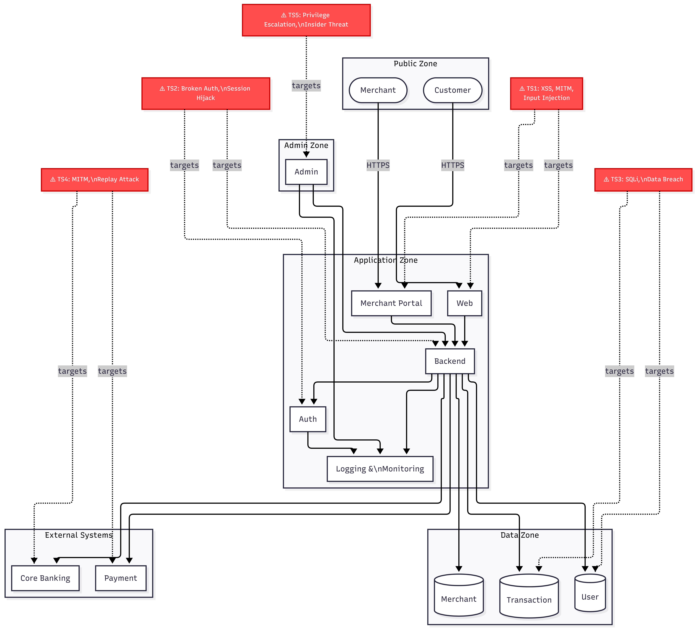

# CS382 – Secure Architecture & Threat Modeling
**Habib University | Semester 8 | Cybersecurity: Theory, Tools, and Practices (CS382)**

| | |
|---|---|
| **Student** | Muhammad Shayaan Qazi |
| **Student ID** | MS08066 |
| **Assignment** | Assignment 1 – Secure Architecture & Threat Modeling |
| **Scenario** | Option A – Online Payment Processing Application |
| **Submitted** | February 2026 |

---

# Task 1 – System Definition & Architecture

## 1.1 System Overview

This system is a web-based online payment processing platform that enables customers to securely pay merchants through card-based transactions. The platform integrates with external banking infrastructure to authorize and settle payments. It exposes a public-facing web interface for customers, a separate portal for merchants, and a restricted administrative interface for internal staff. All components are designed under a cloud-agnostic architecture with no dependency on vendor-specific services, making the system portable and infrastructure-independent.

---

## 1.2 Application Components

| Component | Description |
|---|---|
| **Web Frontend** | The customer-facing interface through which users initiate payments. Communicates with the Backend API over HTTPS. |
| **Merchant Portal** | A separate interface for merchants to manage their accounts, view transaction history, and configure payment settings. |
| **Admin Portal** | A restricted interface for internal administrators to manage users, merchants, and system configuration. Accessible only from the Administrative Zone. |
| **Backend API** | The central application server that processes all business logic, routes requests, and orchestrates communication between all internal and external components. |
| **Authentication Service** | Handles identity verification for all user types (customers, merchants, administrators). Issues and validates session tokens. |
| **User Database** | Stores customer account information, credentials (hashed), and profile data. |
| **Merchant Database** | Stores merchant account details, financial configuration, and integration credentials. |
| **Transaction Database** | Records all payment transactions including status, timestamps, amounts, and references to external payment events. |
| **Payment Gateway** | An external third-party service that processes card payments and communicates authorization responses back to the Backend API. |
| **Core Banking System** | An external banking system that handles fund transfers and settlement between accounts. |
| **Logging & Monitoring System** | A centralized system that collects logs from all components, detects anomalies, and maintains immutable audit trails. |

---

## 1.3 Users and Roles

| Role | Type | Description |
|---|---|---|
| Customer | Human User | Initiates payment transactions through the Web Frontend. |
| Merchant | Human User | Manages merchant account and views transaction data through the Merchant Portal. |
| Administrator | Human User | Manages system configuration, users, and merchants through the Admin Portal. |
| Internal Operations Staff | Human User | Monitors system health and may access logs. Subject to least-privilege access controls. |
| Payment Gateway | External System | Receives payment requests from the Backend API and returns authorization results. |
| Core Banking System | External System | Receives settlement instructions from the Backend API and processes fund transfers. |
| External Attacker | Threat Actor | An unauthorized party attempting to exploit internet-facing components. |
| Malicious Insider | Threat Actor | An internal user (staff or merchant) attempting to abuse authorized access for unauthorized purposes. |

---

## 1.4 Data Types Handled

| Data Type | Sensitivity | Description |
|---|---|---|
| User Credentials | High | Usernames, hashed passwords, MFA tokens used for authentication. |
| Payment Card Data | Critical | Card numbers, expiry dates, CVVs handled during transaction initiation. Tokenized after initial capture. |
| Transaction Records | High | Records of all payment events including amounts, timestamps, status, and merchant references. |
| Merchant Financial Data | High | Merchant account details, settlement preferences, and revenue figures. |
| Authentication Tokens | High | Session tokens and API keys issued by the Authentication Service. |
| Audit Logs | Medium | System-generated records of all user and admin actions for accountability. |
| Administrative Actions | High | Records of configuration changes, user management operations, and system overrides. |

---

## 1.5 External Dependencies

| Dependency | Role |
|---|---|
| Payment Gateway | Processes card transactions and returns authorization status. |
| Core Banking System | Handles fund settlement between financial institutions. |
| Email / SMS Service | Delivers transaction notifications and authentication codes to users. |
| DNS Infrastructure | Resolves domain names for all internet-facing components. |
| Network Infrastructure | Provides connectivity between all zones and external systems. |

---

## 1.6 Trust Boundaries

Trust boundaries define points where data crosses between security zones, requiring validation, authentication, or encryption.

| Boundary | From | To | Controls Required |
|---|---|---|---|
| TB1a | Internet (Public Zone) | Web Frontend | HTTPS/TLS, WAF, Input validation |
| TB1b | Internet (Public Zone) | Merchant Portal | HTTPS/TLS, WAF, Input validation |
| TB2 | Web Frontend / Merchant Portal | Backend API | Authenticated API calls, rate limiting |
| TB3 | Backend API | Databases | Authenticated DB connections, encrypted at rest |
| TB4 | Backend API | Payment Gateway | Mutual TLS, API key authentication |
| TB5 | Backend API | Core Banking System | Mutual TLS, signed requests |
| TB6 | Admin Portal | Backend API | MFA-enforced, role-based access, separate auth plane |
| TB7 | Internal Network | Admin Portal | VPN or restricted network access only |

**Security Zones:**

- **Public Zone** — Untrusted internet-facing users (customers, merchants)
- **Application Zone** — Web Frontend, Merchant Portal, Backend API, Auth Service, Logging & Monitoring
- **Data Zone** — User DB, Merchant DB, Transaction DB
- **External Systems Zone** — Payment Gateway, Core Banking System
- **Administrative Zone** — Admin Portal (restricted access)

---

## 1.7 Architecture Diagram

The diagram illustrates all system components, security zones, and data flows between the Public Zone, Application Zone, Data Zone, Admin Zone, and External Systems Zone.

---

# Task 2 – Asset Identification & Security Objectives

## 2.1 Critical Assets

| Asset | Type | CIA Priority | Rationale |
|---|---|---|---|
| User Credentials | Sensitive | C, I | Must be kept confidential to prevent account takeover. Integrity ensures credentials are not silently altered. |
| Payment Card Data | Financial / Critical | C, I, A | Highest sensitivity. Must be confidential (fraud prevention), accurate (integrity), and available during transactions. |
| Transaction Records | Financial | I, A | Must be tamper-proof for legal compliance and dispute resolution. Must remain available for auditing and reporting. |
| Merchant Financial Data | Financial | C, I | Merchant account details and revenue data are commercially sensitive and must not be exposed or modified. |
| Admin Credentials | Critical | C, I | Compromise grants full system control. Must be confidential and unalterable. |
| Authentication Tokens | Sensitive | C, I | Tokens must be secret to prevent session hijacking, and must not be forged or replayed. |
| Audit Logs | Operational | I, A | Must remain unmodified to ensure accountability. Must be available for incident response and forensic analysis. |
| Business Logic | Intellectual Property | I | If tampered with, attackers could manipulate transaction processing to commit fraud. |

---

## 2.2 Security Objectives

The following four security objectives apply across all assets. Each asset is mapped to the objectives it prioritises.

**Confidentiality** — Sensitive data must only be accessible to authorized parties. Applies to user credentials, payment card data, merchant financial data, admin credentials, and authentication tokens.

**Integrity** — Data must remain accurate and unmodified throughout its lifecycle. Applies to all assets, particularly transaction records, audit logs, and business logic where tampering has direct financial or legal consequences.

**Availability** — Critical systems and data must remain accessible when needed. Applies to transaction records and payment card data, where downtime directly disrupts payment processing.

**Accountability** — Actions performed by users and administrators must be traceable. Applies to audit logs and administrative actions, ensuring non-repudiation and enabling forensic investigation.

---

# Task 3 – Threat Modeling (STRIDE)

## 3.1 Methodology

Threat modeling was performed using the STRIDE framework, applied systematically across the six required threat areas: authentication, authorization, data storage, API communication, logging and monitoring, and administrative access. Each threat was assessed using impact × likelihood reasoning to assign a risk level of Low, Medium, or High.

---

## 3.2 Threat Surface Diagram

The diagram annotates the architecture with five identified threat surfaces (TS1–TS5), each indicated by a red label. Dotted lines connect each threat surface node to the components it targets. Trust boundaries are labeled on relevant data flow edges.

| Threat Surface | Label | Targets |
|---|---|---|
| TS1 | XSS, MITM, Input Injection | Web Frontend, Merchant Portal |
| TS2 | Broken Auth, Session Hijack | Authentication Service, Backend API |
| TS3 | SQL Injection, Data Breach | User DB, Transaction DB, Merchant DB |
| TS4 | MITM, Replay Attack | Payment Gateway, Core Banking System |
| TS5 | Privilege Escalation, Insider Threat | Admin Portal |

---

## 3.3 STRIDE Threat Model Table

| # | Threat | STRIDE Category | Affected Component | Impact | Likelihood | Risk Level |
|---|---|---|---|---|---|---|
| T1 | Attacker intercepts HTTPS traffic between customer and Web Frontend via MITM | Information Disclosure | Web Frontend (TB1a) | Critical — payment card data and credentials exposed | Low (requires TLS downgrade or network position) | **Medium** |
| T2 | Attacker injects malicious scripts into the Web Frontend to steal session tokens (XSS) | Tampering / Information Disclosure | Web Frontend, Merchant Portal (TS1) | High — session hijacking leads to account takeover | High (very common web attack vector) | **High** |
| T3 | Attacker submits malformed input to the Backend API to inject commands or manipulate logic | Tampering | Backend API (TB2) | High — could corrupt transaction logic or extract data | Medium (requires API knowledge) | **High** |
| T4 | Attacker obtains a valid session token and replays it to impersonate an authenticated user | Spoofing | Authentication Service (TS2) | High — full account access without credentials | Medium (tokens often leaked via XSS or logs) | **High** |
| T5 | Brute-force or credential stuffing attack against the login endpoint | Spoofing | Authentication Service (TS2) | High — unauthorized account access | High (automated tooling is widely available) | **High** |
| T6 | Authenticated merchant submits SQL injection payload through the Merchant Portal | Tampering / Information Disclosure | Merchant DB, Transaction DB (TS3) | Critical — full database read or deletion | Medium (requires bypassing input validation) | **High** |
| T7 | Backend API sends payment data over improperly validated TLS channel, enabling MITM | Information Disclosure | Payment Gateway (TB4, TS4) | Critical — live payment card data in transit exposed | Low (requires network-level attacker on backend path) | **Medium** |
| T8 | Attacker replays a previously captured authorized payment request to the Core Banking System | Spoofing | Core Banking System (TB5, TS4) | High — unauthorized fund transfer | Low (requires capture of signed request) | **Medium** |
| T9 | Admin account is compromised; attacker escalates privileges to modify system configuration | Elevation of Privilege | Admin Portal (TS5, TB6) | Critical — full system control | Medium (phishing or credential reuse) | **High** |
| T10 | Malicious insider accesses the Admin Portal from an authorized workstation to exfiltrate data | Elevation of Privilege / Information Disclosure | Admin Portal (TS5) | Critical — bulk data access without triggering alerts | Medium (insider access is authorized at the network layer) | **High** |
| T11 | Application logs are tampered with to erase evidence of a breach | Tampering | Logging & Monitoring System | High — forensic investigation is undermined | Medium (requires write access to log storage) | **High** |
| T12 | Logging system fails to capture an attack event due to misconfiguration or bypass | Repudiation | Logging & Monitoring System | Medium — inability to detect or attribute attacks | Medium (easy to miss without explicit audit rules) | **Medium** |
| T13 | Encrypted data at rest is exposed due to key mismanagement (keys stored alongside data) | Information Disclosure | User DB, Merchant DB, Transaction DB (TS3) | Critical — database encryption is rendered useless | Low (requires key infrastructure access) | **Medium** |
| T14 | Denial of Service attack floods the Backend API, disrupting payment processing | Denial of Service | Backend API | High — payment processing fully unavailable | High (DDoS is low-cost to execute) | **High** |
| T15 | Merchant uses their own authorized credentials to access or modify another merchant's data | Elevation of Privilege | Backend API, Merchant DB | High — cross-tenant data breach | Medium (depends on authorization logic correctness) | **High** |

---

## 3.4 Risk Reasoning

Risk levels were derived by applying the formula: **Risk = Impact × Likelihood**, mapped to a qualitative scale (Low / Medium / High).

**High-risk threats (T2, T3, T4, T5, T6, T9, T10, T11, T14, T15)**

These threats are rated High because they combine a High or Critical impact with a Medium or High likelihood. XSS (T2), credential stuffing (T5), SQL injection (T6), and DDoS (T14) are extremely common in web-facing payment systems and require minimal attacker skill. Privilege escalation through the Admin Portal (T9, T10) carries Critical impact because admin access grants control over the entire system, including all user data and payment routing. Log tampering (T11) is rated High because it directly undermines the effectiveness of every other control — an attacker who can erase audit trails can operate undetected indefinitely. Cross-tenant access (T15) is High because incorrectly scoped authorization in the Backend API could allow one merchant to access another's financial data, constituting both a breach and a compliance violation.

**Medium-risk threats (T1, T7, T8, T12, T13)**

These threats are rated Medium because their likelihood is constrained by technical prerequisites. MITM attacks on TLS connections (T1, T7) require an attacker to be positioned on the network path and to successfully perform a TLS downgrade or certificate substitution — both of which are significantly harder to achieve when TLS is correctly configured. Replay attacks (T8) against the Core Banking System require prior capture of a valid signed request, which is non-trivial. Log misconfiguration (T12) and encryption key mismanagement (T13) are operationally plausible but require specific deployment failures to be exploitable. These threats are not dismissed — they represent residual risks that controls must specifically address.

---

# Task 4 – Secure Architecture Design

Security controls proposed here are architectural — they operate at the system design level, not as code-level patches. Each control is justified by direct reference to threats identified in the STRIDE analysis (Task 3) and mapped to the CIA triad objectives defined in Task 2.

---

## 4.1 Identity and Access Management (IAM)

### Multi-Factor Authentication (MFA)
All user login flows — customer, merchant, and administrator — must require a second authentication factor beyond a password. For administrators, MFA must be mandatory and enforced at the network level (no login plane access without passing MFA).

**Justification:** Directly mitigates T5 (credential stuffing) and T9 (admin account compromise). Even when credentials are leaked or guessed, MFA prevents an attacker from completing the login. Admin MFA specifically addresses T10 (malicious insider) by adding a second barrier to high-value access.

### Role-Based Access Control (RBAC)
Every component in the system must enforce access based on role, not just identity. Customers may only access their own transactions and payment initiation. Merchants may only access their own merchant account and transaction history. Administrators have scoped access to configuration — not raw database access.

**Justification:** Directly mitigates T15 (cross-tenant data access) and T10 (insider abuse). Role scoping ensures that even an authenticated and legitimate user cannot access resources outside their role boundary.

### Least Privilege Enforcement
Every internal service-to-service connection must use a credential that grants only the permissions required for its specific function. The Backend API must not hold database credentials that permit schema modification. The logging service must hold write-only credentials against the audit log store.

**Justification:** Limits blast radius of T6 (SQL injection) and T9 (privilege escalation). If the Backend API is compromised, the attacker inherits only its restricted permissions — not full database control.

### Separate Admin Authentication Plane
The Admin Portal must use a completely separate authentication mechanism from the customer and merchant flows. This means a different login endpoint, different session store, and different credential management system, accessible only from restricted internal networks (TB7).

**Justification:** Mitigates T9 and T10. Separating the admin plane ensures that a compromise of the customer-facing authentication system does not grant admin access, and that admin sessions cannot be hijacked via XSS attacks on the public frontend.

### Strong Session Management
All sessions must use cryptographically random, short-lived tokens. Tokens must be invalidated on logout, after inactivity, and on re-authentication events. Tokens must be transmitted only over HTTPS and stored in HttpOnly, Secure cookies — never in localStorage.

**Justification:** Mitigates T4 (session replay) and T2 (XSS-based token theft). HttpOnly cookies prevent JavaScript access to tokens, directly limiting the damage XSS can cause. Short expiry limits the exploitation window of a stolen token.

---

## 4.2 Network Segmentation

The architecture enforces five security zones with strict inter-zone communication rules:

| Zone | Contents | Communication Rules |
|---|---|---|
| Public Zone | Internet-facing users (customers, merchants) | May only reach Application Zone via TB1a, TB1b over HTTPS |
| Application Zone | Web Frontend, Merchant Portal, Backend API, Auth Service, Logging | Internal components communicate over authenticated channels; Frontends have no direct access to Data Zone |
| Data Zone | User DB, Merchant DB, Transaction DB | Accessible only from Backend API over authenticated, encrypted connections (TB3) |
| External Systems Zone | Payment Gateway, Core Banking System | Accessible only from Backend API over Mutual TLS (TB4, TB5) |
| Administrative Zone | Admin Portal | Accessible only via VPN or internal restricted network (TB7); communicates with Backend API via separate auth plane (TB6) |

**Justification:** Segmentation limits lateral movement. If an attacker compromises the Web Frontend (via T2 or T3), they cannot directly reach databases or admin systems — they must pivot through the Backend API, which enforces authentication and authorization at every boundary. This constrains T9, T10, T15 and reduces the blast radius of all other threats.

---

## 4.3 Data Protection

### TLS for All Communications
All in-transit communication must use TLS 1.2 or higher with valid certificates. Mutual TLS (mTLS) must be used for Backend API → Payment Gateway (TB4) and Backend API → Core Banking System (TB5), ensuring that both sides authenticate the connection.

**Justification:** Mitigates T1 (customer MITM), T7 (payment data in transit), and T8 (replay attacks). mTLS specifically prevents an attacker from impersonating the Payment Gateway, and adds replay resistance because requests are signed by the client certificate.

### Encryption at Rest
All three databases must use AES-256 encryption at rest. Field-level encryption must be applied to especially sensitive columns such as payment card data and authentication credentials, using keys stored separately from the database files.

**Justification:** Mitigates T13. Encryption at rest ensures that raw database files, backups, or storage media cannot be read without the decryption keys, even if physical media is compromised.

### Payment Card Data Tokenization
Card data must be tokenized immediately after initial capture at the point of transaction initiation. The actual card number (PAN) must not be stored in the Transaction Database or transmitted beyond the tokenization boundary. Only the token is retained for subsequent reference.

**Justification:** Reduces the value of a successful T6 or T13 attack. Even if an attacker exfiltrates the Transaction Database, they obtain non-reversible tokens rather than live card numbers, which cannot be used for fraud.

### Strong Credential Hashing
User passwords must be hashed using a memory-hard algorithm (bcrypt or Argon2) before storage. No plaintext or weakly hashed passwords may be stored at any layer.

**Justification:** Mitigates T6 and T13. If the User DB is exfiltrated, passwords cannot be trivially recovered through brute-force or rainbow table attacks.

---

## 4.4 Secrets Management

### No Hardcoded Credentials
All API keys, database passwords, TLS certificates, and service credentials must be injected at runtime from a dedicated secrets management solution. No credentials may appear in source code, configuration files committed to version control, or build artefacts.

**Justification:** Prevents a class of vulnerability where a source code exposure immediately results in full system compromise. Directly relevant to T9 and T13.

### Secure Secret Storage with Scoped Access
A dedicated secrets management system must store all credentials. Secrets must be scoped to specific services — the Backend API credential for the Payment Gateway must not be accessible to the Logging Service. Access to secrets must be logged and audited.

**Justification:** Enforces least privilege at the credential level, limiting what a compromised service can access. Supports T9 and T10 mitigations.

### Key Rotation Policies
Encryption keys, API keys, and session signing keys must be rotated on a defined schedule. Key rotation must be automated where possible to eliminate human error.

**Justification:** Limits the window of exposure if a key is silently compromised. Directly addresses the residual risk in T13.

---

## 4.5 Monitoring and Logging

### Centralized, Immutable Logging
All components must emit structured logs to the centralized Logging & Monitoring System. The log store must be append-only — application-layer credentials must not have the ability to delete or modify existing log entries. Log access must require separate, elevated permissions distinct from application credentials.

**Justification:** Directly mitigates T11 (log tampering) and T12 (log bypass). Immutability ensures that an attacker who compromises the application layer cannot retroactively erase evidence. Centralized collection ensures that component-level bypasses cannot achieve total log suppression.

### Alerting on Suspicious Behavior
The monitoring system must define automated alert rules for: repeated failed logins (→ T5), abnormal transaction volumes (→ T14), admin actions outside business hours (→ T10), and cross-tenant data access patterns (→ T15). Alerts must be routed to a human-monitored channel with defined response SLAs.

**Justification:** Converts logging from a passive record into an active detection layer. This is the primary control against insider threats and ongoing attacks that bypass perimeter defenses.

### Non-Repudiable Audit Trails for Admin Actions
Every action taken through the Admin Portal — user modification, merchant configuration, system override — must generate a structured, immutable audit record including the acting user, timestamp, action taken, target resource, and source IP.

**Justification:** Provides accountability (the fourth security objective from Task 2). Directly addresses T10 by ensuring that all insider actions are traceable and cannot be denied.

---

## 4.6 Secure Deployment Practices

### Secure CI/CD Pipeline
The build and deployment pipeline must incorporate automated security checks: static analysis (SAST), dependency vulnerability scanning (SCA), and secret detection. No deployment may proceed if critical-severity vulnerabilities are detected.

**Justification:** Prevents the introduction of known-vulnerable libraries exploitable via T3 or T6, and prevents accidental credential exposure relevant to T9 and T13.

### Infrastructure as Code (IaC)
All infrastructure — networks, firewall rules, database configurations, and zone definitions — must be defined in version-controlled IaC files. Manual configuration changes must be prohibited in production environments.

**Justification:** Enforces the network segmentation design in 4.2. IaC prevents configuration drift, where manual changes inadvertently open trust boundaries or disable security controls, undermining T1, T7, and T9 mitigations.

### Patch Management
All operating system, runtime, and library dependencies must be patched within a defined SLA (critical CVEs within 72 hours). A software bill of materials (SBOM) must be maintained to enable rapid identification of affected components following a new vulnerability disclosure.

**Justification:** Reduces the attack surface for all threats by ensuring that known exploitable vulnerabilities are not present in the deployed system.

---

## 4.7 Defense-in-Depth Summary

The controls above are not independent solutions — they are layered to create defense-in-depth, where each High-risk threat from Task 3 is addressed by at least two independent controls:

| Threat | Primary Control | Secondary Control | Residual Risk After Controls |
|---|---|---|---|
| T2 (XSS, token theft) | HttpOnly session cookies | Content Security Policy (deployment layer) | Minimal — tokens inaccessible to JavaScript |
| T5 (credential stuffing) | MFA | Rate limiting on login endpoint | Residual DoS risk on login endpoint |
| T6 (SQL injection) | Parameterized queries (deployment), RBAC | Least privilege DB credentials, encryption at rest | Constrained — no credential grants schema-wide access |
| T9 (admin compromise) | Separate admin auth plane, MFA | RBAC, immutable audit trails | Insider with physical key access remains out-of-scope risk |
| T10 (malicious insider) | Immutable audit trails, behavioral alerting | RBAC, least privilege, separation of duties | Legitimate access cannot be prevented — only detected and investigated |
| T11 (log tampering) | Immutable, append-only log store | Separate log credentials scoped write-only | Compromise of log infrastructure platform itself |
| T14 (DDoS) | Rate limiting (deployment layer) | Network segmentation limits exposed attack surface | Full volumetric DDoS requires upstream infrastructure mitigation |
| T15 (cross-tenant access) | RBAC, scoped API authorization | Audit alerting on anomalous access patterns | Depends on correct implementation of authorization logic |

No single control eliminates any threat completely. The value of defense-in-depth is that an attacker must defeat multiple independent layers — a failure in one layer (e.g., MFA bypass) does not translate into a full breach, because RBAC, audit logging, and network segmentation remain independently in place.

---

## 4.8 Updated Secure Architecture Diagram

The updated diagram incorporates all architectural security controls defined in sections 4.1–4.6. Key additions over the base architecture diagram include: WAF and rate limiter at the public entry point, HttpOnly cookie enforcement on frontends, MFA and short-lived tokens on the Auth Service, RBAC enforcement on the Backend API, append-only logging with alerting on the Logging & Monitoring system, a separate Admin Auth Plane, AES-256 encryption and tokenization labels on the Data Zone, mTLS on all external system connections, and a Secrets Manager injecting runtime credentials into the Backend API.

---

# Task 5 – Risk Treatment & Residual Risk

## 5.1 Methodology

For each High-risk threat identified in Task 3, a treatment decision was made using the standard four options: **Mitigate** (apply controls to reduce likelihood or impact), **Transfer** (shift responsibility to a third party), **Accept** (acknowledge the risk without additional action), or **Avoid** (eliminate the activity or component that introduces the risk). Medium-risk threats are addressed in section 5.3.

---

## 5.2 Risk Treatment Table — High-Risk Threats

| # | Threat | Risk Level | Treatment | Justification | Residual Risk |
|---|---|---|---|---|---|
| T2 | XSS — session token theft via malicious script injection | High | **Mitigate** | HttpOnly cookies prevent script access to tokens. Content Security Policy (CSP) restricts script execution sources. Input sanitization at the API layer prevents stored XSS. | A sophisticated CSP bypass or browser zero-day could still expose tokens. Risk is low after controls but not zero. |
| T3 | API input injection — malformed requests manipulate backend logic | High | **Mitigate** | Parameterized queries and input validation at the API layer prevent injection. RBAC limits what any single injected request can affect. | If a new injection vector is discovered in an unvalidated code path, it could succeed. Dependent on implementation quality. |
| T4 | Session replay — stolen token reused to impersonate a user | High | **Mitigate** | Short-lived tokens with binding to session context (IP or device fingerprint) limit replay window. Token invalidation on logout and re-auth events. | Replay within the token's valid window remains possible if the token is stolen before expiry. |
| T5 | Credential stuffing — automated login attempts with leaked passwords | High | **Mitigate** | MFA makes stolen credentials alone insufficient. Rate limiting and account lockout reduce brute-force feasibility. | Users who bypass MFA enrollment or use weak second factors remain exposed. Cannot fully prevent targeting of non-MFA accounts. |
| T6 | SQL injection by authenticated merchant through Merchant Portal | High | **Mitigate** | Parameterized queries, least privilege DB credentials, and RBAC prevent injection and limit blast radius. Card tokenization reduces the value of any data extracted. | Depends on consistent implementation across all DB-touching code paths. A missed unparameterized query creates a residual window. |
| T9 | Admin account compromise via phishing or credential reuse | High | **Mitigate** | Separate admin auth plane isolates compromise. MFA enforced at network level. Admin actions fully logged with immutable audit trail. | A sufficiently sophisticated spear-phishing attack that defeats MFA (e.g., real-time phishing proxy) remains a residual risk. |
| T10 | Malicious insider abuses Admin Portal to exfiltrate data | High | **Mitigate + Accept (partial)** | RBAC, least privilege, and behavioral alerting reduce both access scope and detection time. Full prevention of insider abuse using legitimate access is architecturally impossible. | An authorized insider with a legitimate use case for the data they exfiltrate cannot be prevented at the architecture layer — only detected after the fact. This residual risk is accepted as inherent to insider threat scenarios. |
| T11 | Audit logs tampered with to erase breach evidence | High | **Mitigate** | Append-only log store with write-only application credentials makes log deletion impossible from the application layer. Separate log access credentials require elevation. | If the log infrastructure platform itself (storage system or log aggregator) is compromised at a privileged level, log integrity could be violated. This is an infrastructure-layer risk outside the application architecture scope. |
| T14 | DDoS attack floods Backend API, disrupting payment processing | High | **Transfer + Mitigate** | Volumetric DDoS mitigation is transferred to upstream infrastructure (ISP-level or network provider scrubbing). Rate limiting and network segmentation provide application-layer mitigation for lower-volume attacks. | Full absorption of a large-scale volumetric DDoS attack cannot be guaranteed without dedicated upstream scrubbing infrastructure. This is accepted as a deployment-time operational decision. |
| T15 | Cross-tenant data access — merchant accesses another merchant's data | High | **Mitigate** | RBAC enforces tenant-scoped queries. All API calls are authorized against the requesting principal's tenant context, not just their authentication status. Audit alerting detects anomalous cross-tenant access patterns. | Residual risk exists in the correctness of the authorization implementation. A logic error in tenant scoping would not be caught by architectural controls alone — it requires code review and testing. |

---

## 5.3 Medium-Risk Threats — Treatment Summary

| # | Threat | Treatment | Rationale |
|---|---|---|---|
| T1 | MITM on customer HTTPS traffic | Mitigate | TLS 1.2+ with valid certificates. WAF at entry point. |
| T7 | MITM on Backend API → Payment Gateway channel | Mitigate | mTLS enforces mutual authentication. Certificate pinning optional for additional hardening. |
| T8 | Replay attack on Core Banking System | Mitigate | mTLS + signed, timestamped requests with nonces make replay infeasible. |
| T12 | Logging misconfiguration — attack events not captured | Mitigate | Centralized logging with explicit audit rules covering all required event types. Alerting on log gaps. |
| T13 | Encryption key mismanagement — encrypted data exposed | Mitigate | Secrets manager with scoped access, automated key rotation, and keys stored separately from data. |

---

## 5.4 Residual Risk Summary

After all treatment decisions are applied, three categories of residual risk remain:

**Implementation-dependent residual risks (T3, T6, T15)**

These risks depend on the correctness of the implementation, not the architecture. Parameterized queries, RBAC scope, and tenant authorization logic must be correctly written in every affected code path. Architecture sets the policy; code must enforce it. No architectural control can substitute for a code review and security testing process at deployment time.

**Insider threat residual risk (T10)**

An authorized user with legitimate access to high-value data cannot be architecturally prevented from misusing that access — they can only be detected. The residual risk is that detection occurs after the fact, and that some exfiltration may occur before alerting triggers. This is accepted as inherent to any system that must grant real access to real users.

**Infrastructure-layer residual risks (T11, T14)**

Log infrastructure compromise and large-scale DDoS require mitigations that operate below the application architecture layer — at the infrastructure, ISP, or hardware level. These risks are explicitly accepted as out of scope for this application architecture design, and must be addressed through operational and infrastructure controls outside this report's scope.

---

# Task 6 – Final Architecture and Threat Report

## 6.1 Executive Summary

This report presents a complete secure architecture design for an online payment processing application. Starting from a defined system architecture (Task 1), critical assets and security objectives were identified (Task 2), followed by a structured STRIDE threat model across all required threat areas (Task 3). Architectural security controls were proposed in response to identified threats (Task 4), and each high-risk threat was given a formal risk treatment decision with residual risk explanation (Task 5).

The architecture is cloud-agnostic, assumes internet-facing exposure, and accounts for both external attackers and malicious insiders. All controls are architectural — no code-level fixes are proposed, and all decisions are justified using risk-based reasoning.

---

## 6.2 System Overview

The system is a web-based online payment processing platform enabling customers to pay merchants through card transactions, integrated with external banking infrastructure. It exposes a customer-facing web interface, a merchant management portal, and a restricted administrative portal, backed by a central API, authentication service, and logging system. Three databases store user, merchant, and transaction data. External integrations include a Payment Gateway and a Core Banking System.

Full component definitions, user roles, data types, external dependencies, and trust boundary mappings are documented in Task 1 of this report.

---

## 6.3 Architecture Diagrams

### Base Architecture

Shows all system components, security zones (Public, Application, Data, Admin, External Systems), and data flows between them.

### Threat Surface Diagram

Annotates the base architecture with five threat surfaces (TS1–TS5), identifying components targeted by XSS/MITM, broken authentication, SQL injection, MITM on external channels, and privilege escalation.

### Secure Architecture Diagram

Updated architecture diagram incorporating all security controls: WAF, MFA, RBAC, HttpOnly cookies, mTLS, encryption at rest, tokenization, append-only logging, separate admin auth plane, and secrets management.

---

## 6.4 Asset Inventory Summary

Full asset inventory with CIA priority mapping is documented in Task 2. Critical assets include:

| Asset | CIA Priority | Highest Risk |
|---|---|---|
| Payment Card Data | C, I, A | Tokenized after capture; protected by TLS and encryption at rest |
| User Credentials | C, I | bcrypt hashed; MFA enforced |
| Admin Credentials | C, I | Separate auth plane; MFA mandatory |
| Transaction Records | I, A | Immutable logs; tamper resistance |
| Audit Logs | I, A | Append-only store; separate access credentials |

---

## 6.5 Threat Model Summary

Full STRIDE threat model is documented in Task 3. 15 threats were identified across all 6 required areas:

| Threat Area | Threats Identified | Highest Risk |
|---|---|---|
| Authentication | T4, T5 | Credential stuffing (High), session replay (High) |
| Authorization | T9, T10, T15 | Admin compromise (High), insider abuse (High), cross-tenant access (High) |
| Data Storage | T6, T13 | SQL injection (High), key mismanagement (Medium) |
| API Communication | T1, T3, T7, T8 | Input injection (High), MITM on payment channel (Medium) |
| Logging & Monitoring | T11, T12 | Log tampering (High), log bypass (Medium) |
| Administrative Access | T9, T10 | Admin compromise (High), malicious insider (High) |

---

## 6.6 Security Controls Summary

Full control specifications and justifications are in Task 4. Controls are organized by category:

| Category | Key Controls |
|---|---|
| Identity & Access Management | MFA, RBAC, least privilege, separate admin auth plane, HttpOnly session tokens |
| Network Segmentation | 5-zone architecture with strict inter-zone communication rules |
| Data Protection | TLS 1.2+, mTLS, AES-256 at rest, card tokenization, bcrypt password hashing |
| Secrets Management | Runtime credential injection, scoped access, automated key rotation |
| Monitoring & Logging | Append-only centralized logs, behavioral alerting, non-repudiable admin audit trails |
| Secure Deployment | SAST/SCA in CI/CD, Infrastructure as Code, patch management SLA |

---

## 6.7 Residual Risks

Full risk treatment decisions and residual risk analysis are in Task 5. Three categories of residual risk remain after all controls are applied:

1. **Implementation-dependent risks (T3, T6, T15)** — Architectural controls set policy; correct implementation of parameterized queries, RBAC scoping, and tenant authorization logic is required at the code level.
2. **Insider threat residual (T10)** — Authorized users with legitimate access cannot be architecturally prevented from misuse — only detected after the fact via audit logs and behavioral alerting.
3. **Infrastructure-layer risks (T11, T14)** — Log platform compromise and large-scale DDoS require infrastructure-level controls outside the application architecture scope. Accepted as operational risks.

---

## 6.8 Assumptions

- The system is internet-facing; no assumption of network-level perimeter protection is made.
- The Payment Gateway and Core Banking System comply with industry cryptographic standards (TLS, signed requests).
- All users — including internal staff — are considered potential threat actors under a zero-trust principle.
- Insider threats from authorized users are included in scope.
- No vendor-specific cloud services are assumed; the architecture is cloud-agnostic and portable.
- Regulatory frameworks (e.g., PCI-DSS, GDPR) are not explicitly mapped, though the controls proposed align with their requirements.

---

## 6.9 Limitations

- This is a high-level architectural design. Implementation correctness — parameterized queries, CSP headers, RBAC scope logic — is outside the scope of this report and must be ensured through code review and security testing.
- No real-world infrastructure constraints are modeled. Network topology, physical security, and hardware-level controls are not addressed.
- No specific regulatory framework is assumed. Compliance mapping to PCI-DSS or GDPR would require additional analysis.
- Volumetric DDoS mitigation is beyond the application architecture layer and is not fully addressed here.
- The threat model and controls are based on the defined system scope. New components or integrations added after this report would require a fresh threat modeling exercise.

---
